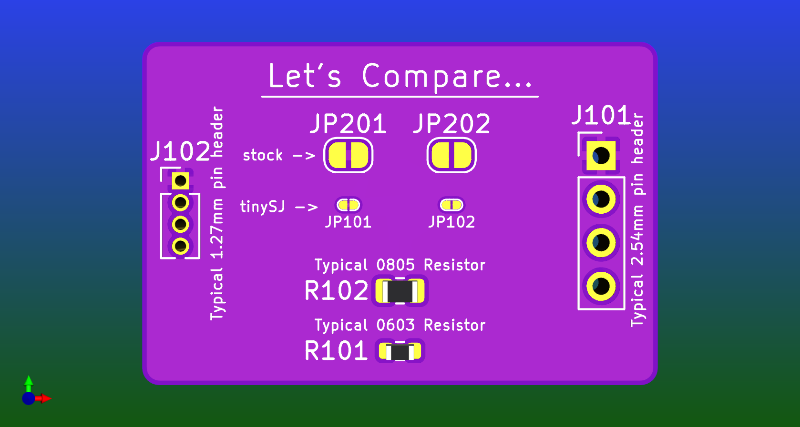
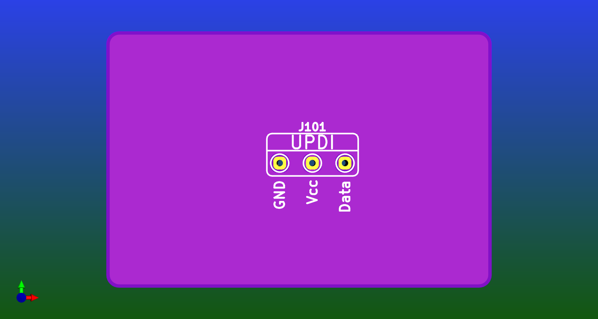

## A better USB-C footprint

* **USB_C.kicad_sym**
* **USB_C.kicad_mod**

A much stronger and easier routed footprint than typical.

Combines the data lines.  (This may be handy since most installations of a USB-C connector include bridging these together in your design...)

**tests 2.kicad_pro** is an example of usage for this footprint.

## A handy footprint for power output.

* **USB_A-C_2.0_XT30.kicad_sym**
* **USB_A+C+XT30.kicad_mod**

Allows for USB-A, USB-C or an XT30 connector.

USB-A includes the data lines so it will work for a QC source.

USB-C includes the data lines AND the CC & SBU lines so it will work for a QC or PD source. (as well as whatever the SBU pins are actually for... Closest I've managed to find to a useful description is as Agnd & Mic in "Audio Adapter Accessory Mode".)

  
  
   
  

> [!NOTE]
> the origin of this footprint is now where the centre line meets the board edge.

> [!TIP]
> You can select the model for 3D renders by going into the footprint properties after placing it on your PCB, selecting the "3d Models" tab & enabling whichever model you like.

**tests.kicad_pro** is an example of usage for this footprint.

## Solder Jumpers that actually fit.

* **tinySJ-Open.kicad_mod**
* **tinySJ-Bridged.kicad_mod**

The solder jumper footprints that come standard with KiCAD are handy, but massive.

These are not massive.

## A pogo-pin connection point for UPDI programming

* **UPDI_connection.kicad_sym**
* **UPDI.kicad_mod**

